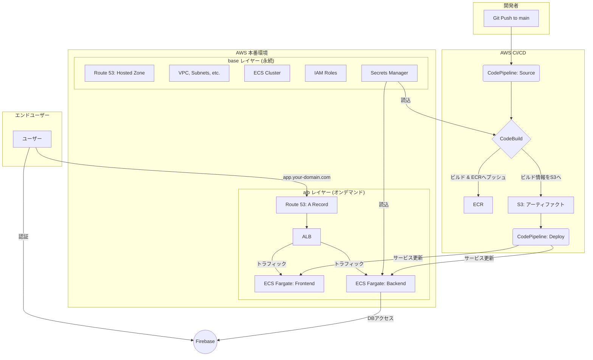

# LifePlan - 未来家計シミュレーションアプリ

個人のライフプランに基づいた未来の家計をシミュレーションし、可視化するWebアプリケーションです。

## 📜 目次

- [✨ 概要](#-概要)
- [🛠️ 技術スタック](#️-技術スタック)
- [📂 プロジェクト構造](#-プロジェクト構造)
- [💻 ローカル開発](#-ローカル開発)
- [✅ テスト](#-テスト)
- [🚀 本番環境（AWS）](#-本番環境aws)
- [🔄 CI/CD](#-cicd)
- [🔒 環境変数とシークレット](#-環境変数とシークレット)
- [🔮 今後の改善案](#-今後の改善案)

## ✨ 概要

React (Create React App) と Node.js (Express) によるモノレポ構成のアプリケーションです。インフラは Terraform でコード管理され、AWS 上に構築されます。

**アーキテクチャの特徴**: インフラを**永続** (`base`) と**オンデマンド** (`alb`) の2レイヤーに分割。開発時間外は `alb` レイヤー（ALB, ECSサービス等）を `terraform destroy` することで、コストを最小限に抑えます。



## 🛠️ 技術スタック

| カテゴリ | 技術 |
| :--- | :--- |
| **フロントエンド** | React, TypeScript, Create React App, pnpm, Tailwind CSS, Chart.js |
| **バックエンド** | Node.js, Express, TypeScript, pnpm, Zod |
| **データベース** | Google Firestore |
| **インフラ** | AWS (ECS Fargate, ALB, ECR, S3, Route 53), Terraform |
| **CI/CD** | AWS CodePipeline, AWS CodeBuild, GitHub Actions |

## 📂 プロジェクト構造

```
.
├── .github/workflows/ci.yml # CI (テスト実行) の定義
├── backend/                 # バックエンド (Node.js/Express)
├── frontend/                # フロントエンド (React/CRA)
├── infra/
│   ├── base/                # 永続インフラ (VPC, ECR, ECS Clusterなど)
│   └── alb/                 # オンデマンドインフラ (ALB, ECS Service, CI/CDなど)
├── scripts/                 # サービス起動・停止スクリプト
└── pnpm-workspace.yaml
```

## 💻 ローカル開発

**前提ツール**: Node.js (v18+), pnpm (v8+), Docker

1.  **リポジトリの準備**:
    ```bash
    git clone <repository_url> && cd LifePlan && pnpm install
    ```

2.  **環境変数の設定**:
    各ディレクトリの `.env.example` をコピーして `.env` ファイルを作成し、内容を編集します。
    - **フロントエンド**: `cp frontend/.env.example frontend/.env`
    - **バックエンド**: `cp backend/.env.example backend/.env`
        - `SERVICE_ACCOUNT_KEY`には、FirebaseのサービスアカウントキーJSONをBase64エンコードした文字列を設定します。
        - `base64 -i path/to/serviceAccountKey.json | tr -d '\n'`

3.  **開発サーバーの起動**:
    ```bash
    pnpm dev
    ```
    - **PCブラウザからのアクセス**:
        - フロントエンド: `http://localhost:3000`
        - バックエンド: `http://localhost:3001`
    - **実機（スマートフォン）からのアクセス**:
        1. PCのローカルIPアドレスを確認します (`ipconfig getifaddr en0` など)。
        2. `frontend/.env` に `REACT_APP_BACKEND_URL=http://<あなたのPCのIPアドレス>:3001` を設定します。
        3. 開発サーバーを再起動します (`pnpm dev`)。
        4. スマートフォンのブラウザから `http://<あなたのPCのIPアドレス>:3000` にアクセスします。

4.  **開発サーバーの停止**:
    ```bash
    pnpm dev:down
    ```

## ✅ テスト

- **フロントエンド (Vitest)**:
  ```bash
  # 全テスト実行
  pnpm --filter lifeplan-frontend test
  # UIモードで起動
  pnpm --filter lifeplan-frontend test:ui
  ```
- **バックエンド (Jest)**:
  ```bash
  # 全テスト実行
  pnpm --filter lifeplan-backend test
  ```

## 🚀 本番環境（AWS）

**前提**: AWSアカウント, AWS CLI, 取得済みドメイン, Firebaseプロジェクト, GitHubリポジトリ

1.  **永続インフラ (`base`) のデプロイ**:
    1.  **シークレット登録**: AWS Secrets Managerに `prd/life-plan-app/firebase` (FirebaseキーJSON) と `dockerhub/credentials` (DockerHubアクセストークン) を作成します。
    2.  **変数設定**: `infra/base/terraform.tfvars` に `domain_name` を設定します。
    3.  **適用**: `cd infra/base && terraform init && terraform apply` を実行します。

2.  **オンデマンドインフラ (`alb`) のデプロイ**:
    1.  **変数設定**: `infra/alb/terraform.tfvars` に `domain_name`, `subdomain_name`, `dockerhub_username` を設定します。
    2.  **適用**: プロジェクトルートで `./scripts/start_services.sh` を実行します。
    3.  **承認**: AWSコンソールの `CodeStar Connections` で保留中の接続を承認します。
    4.  **初回実行**: AWS `CodePipeline` のコンソールからパイプラインを手動で初回実行します。

**運用（コスト削減）**:
- **停止**: `./scripts/stop_services.sh` (`alb` レイヤーを `destroy`)
- **起動**: `./scripts/start_services.sh` (`alb` レイヤーを `apply`)

## 🔄 CI/CD

- **CI (Pull Request時)**: GitHub Actionsが `main` ブランチへのPRをトリガーに、全テストとビルドチェックを自動実行します。 (`.github/workflows/ci.yml`)
- **CD (Merge時)**: PRがマージされると、AWS CodePipelineが `main` ブランチの最新コードを検知し、ビルド→ECRへプッシュ→ECSへローリングアップデート、という一連のデプロイを自動で行います。

## 🔒 環境変数とシークレット

| 環境 | 設定場所 | 詳細 |
|:---|:---|:---|
| **ローカル** | `frontend/.env`, `backend/.env` | `docker-compose.yml` により各コンテナに読み込まれます。 |
| **本番** | AWS Secrets Manager, CodeBuild Env | Terraformコードには秘密情報を含まず、IAMロール経由で安全に読み込まれます。 |

## 🔮 今後の改善案

- Terraform StateのS3バックエンドへの移行
- ステージング環境の構築
- CloudWatchによる監視体制の強化
- HTTPS対応 (ALBへのACM証明書割当)
