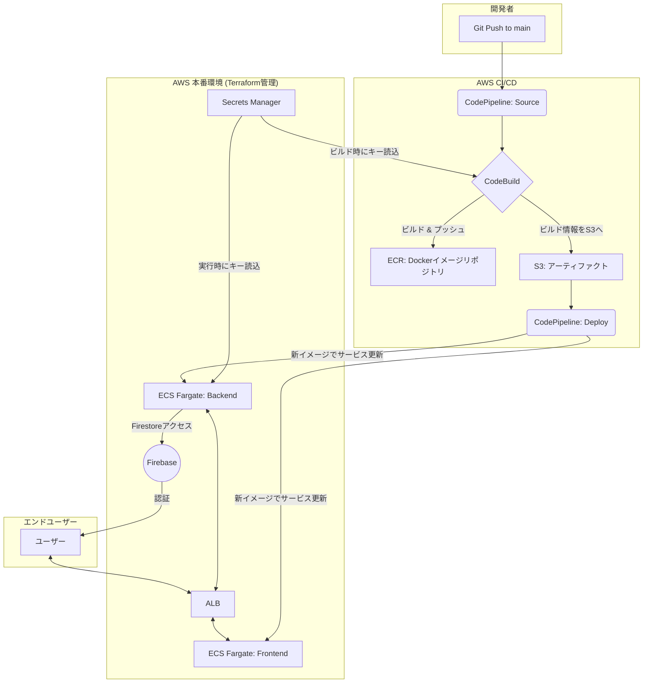

# LifePlan - Financial Future Simulation App

未来の家計をシミュレーションし、可視化するためのWebアプリケーションです。

## 📜 目次

- [アーキテクチャ概要](#-アーキテクチャ概要)
- [技術スタック](#-技術スタック)
- [プロジェクト構造](#-プロジェクト構造)
- [ローカル開発環境セットアップ](#-ローカル開発環境セットアップ)
- [コスト削減スクリプト](#-コスト削減スクリプト)
- [環境変数](#-環境変数)
- [インフラとCI/CD](#-インフラとcicd)
- [⚠️ 最重要注意事項 (必読)](#️-最重要注意事項-必読)
- [今後の改善案](#-今後の改善案)

## 🏗️ アーキテクチャ概要

本プロジェクトは、React(Vite)によるフロントエンド、Node.js(Express)によるバックエンドで構成されるモノレポです。インフラはAWS上にTerraformで構築され、CI/CDはAWSのネイティブサービスで完結しています。



## 🛠️ 技術スタック

| カテゴリ       | 技術                                                                                             |
| -------------- | ------------------------------------------------------------------------------------------------ |
| **フロントエンド** | React, TypeScript, Vite, pnpm, Tailwind CSS, Chart.js, react-chartjs-2, react-icons                |
| **バックエンド**   | Node.js, Express, TypeScript, pnpm, Zod                                                          |
| **データベース**   | Google Firestore                                                                                 |
| **インフラ**     | AWS (ECS Fargate, ALB, ECR, S3, Secrets Manager, CloudWatch), Terraform                          |
| **CI/CD**        | AWS CodePipeline, AWS CodeBuild, GitHub                                                          |

## 📂 プロジェクト構造

```
.
├── backend/         # バックエンド (Node.js/Express)
├── frontend/        # フロントエンド (React/Vite)
├── infra/           # インフラ定義 (Terraform)
├── scripts/         # コスト削減用スクリプト (ALB/ECSサービスの停止・起動)
├── .github/         # GitHub Actions (CI) - (現在未使用)
├── buildspec.yml    # CodeBuild定義ファイル
└── docker-compose.yml # ローカル開発環境定義
```

## 💻 ローカル開発環境セットアップ

#### 1. 前提ツール

- Node.js (v18.x)
- pnpm (v8.x)
- Docker & Docker Compose
- Terraform

#### 2. リポジトリのクローンと依存関係のインストール

```bash
git clone <repository_url>
cd LifePlan
pnpm install
```

#### 3. 環境変数の設定

プロジェクトのルートディレクトリに `.env` という名前のファイルを手動で作成し、以下の内容をコピー＆ペーストしてください。
このファイルはフロントエンドとバックエンドの両方から参照されます。その後、各値を設定します。

```env
# For Backend Service
# CAUTION: Set the Base64 encoded string of your GCP service account key JSON.
SERVICE_ACCOUNT_KEY=

# For Frontend Service
REACT_APP_FIREBASE_API_KEY=
REACT_APP_FIREBASE_AUTH_DOMAIN=
REACT_APP_FIREBASE_PROJECT_ID=
REACT_APP_FIREBASE_STORAGE_BUCKET=
REACT_APP_FIREBASE_MESSAGING_SENDER_ID=
REACT_APP_FIREBASE_APP_ID=
```

#### 4. 開発サーバーの起動

```bash
docker-compose up --build
```
- **フロントエンド**: `http://localhost:3000`
- **バックエンド API**: `http://localhost:3001`


## 💸 コスト削減スクリプト

プロジェクトルートの`/scripts`ディレクトリには、開発時間外に不要なAWSリソースを停止・起動してコストを削減するためのシェルスクリプトが含まれています。

- `stop_services.sh`: ALBとECSサービス（フロントエンド・バックエンド）を停止します。
- `start_services.sh`: 停止したリソースを再度起動します。

**注意**: これらのスクリプトはTerraformで管理されているリソースの一部（ALBのリスナーやECSサービスの希望タスク数など）を直接変更します。実行後はTerraformのstateと実際の状態に差分が生まれる可能性があるため、開発を再開する際は`infra`ディレクトリで`terraform apply`を再実行することを推奨します。

## 🔒 環境変数

ローカル開発と本番環境では、環境変数の管理方法が異なります。

| 環境     | 設定ファイル/場所                          | 説明                                                         |
| :------- | :----------------------------------------- | :----------------------------------------------------------- |
| **ローカル** | プロジェクトルートの`.env`                 | `docker-compose`によってフロントエンドとバックエンドのコンテナに読み込まれます。 |
| **本番**   | AWS Secrets Manager `prd/life-plan-app/firebase` | JSON形式で全てのキーと値を一元管理。ビルド時または実行時に各サービスに注入されます。 |

## 🚀 インフラとCI/CD

### Terraformによるインフラ管理

`/infra`ディレクトリで`terraform`コマンドを実行します。
TerraformのStateは現在ローカル（`terraform.tfstate`）で管理されています。チーム開発を本格化する際は、S3バックエンドへの移行を強く推奨します。

### CI/CD フロー

1.  **トリガー**: `main`ブランチへのプッシュ。
2.  **CodePipeline起動**: ソースコードを取得し、`Build`ステージへ。
3.  **CodeBuild実行 (`buildspec.yml`)**:
    1.  Secrets ManagerからFirebaseのキーを取得。
    2.  `frontend`と`backend`のDockerイメージをビルドし、ECRにプッシュ。
    3.  デプロイ用の`imagedefinitions.json`ファイルを生成。
4.  **ECSデプロイ**: CodePipelineが`ECS`プロバイダーとして動作し、ECR上の最新イメージを使ってECSサービスをローリングアップデートします。

## ⚠️ 最重要注意事項 (必読)

### 1. ALBの再作成とFirebase承認済みドメインの更新

**`infra`ディレクトリで`terraform destroy`からの`terraform apply`を実行すると、ALBのDNS名が必ず変更されます。**

新しいALBのDNS名でGoogle認証を機能させるには、**手動での作業が必須**です。

1.  `cd infra && terraform output alb_dns_name` で新しいDNS名を確認します。
2.  **Firebaseコンソール** > **Authentication** > **Settings** > **承認済みドメイン** を開きます。
3.  古いDNS名を削除し、新しいDNS名をリストに追加します。

**この作業を怠ると、本番環境でGoogleログインが`auth/unauthorized-domain`エラーで失敗します。**

### 2. Secrets Managerの構造

本番環境のシークレットは、`prd/life-plan-app/firebase`という単一のシークレットに、**キー/値ペアのJSON形式**で保存されています。プレーンテキスト形式ではないため、キーを追加・更新する際は必ずJSON構造を維持してください。

## 🔮 今後の改善案

- **Terraform Stateの共有**: S3バックエンドとDynamoDBによるロック機構を導入する。
- **Firebase承認済みドメインの自動化**: `terraform apply`後に、AWS SDKやFirebase CLIを使って承認済みドメインを自動更新するスクリプトを検討する。
- **ステージング環境の構築**: `main`ブランチとは別に`develop`ブランチ用のインフラ・パイプラインを構築し、本番デプロイ前の検証を行えるようにする。
- **監視体制の強化**: CloudWatchダッシュボードやアラームを設定し、アプリケーションの健全性を常時監視する。
- **CIの有効化**: 現在プレースホルダーとなっている`.github/workflows`を有効化し、Pull Request時の自動テストとリンター実行を導入する。
