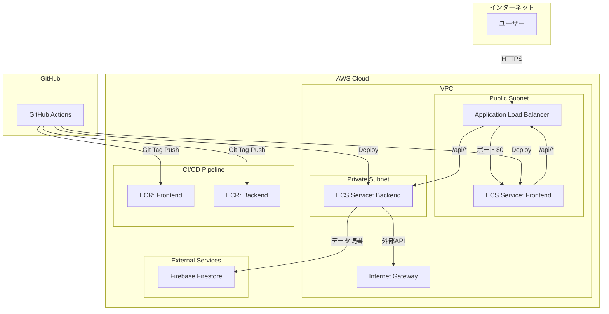
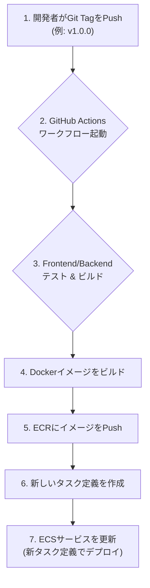

# LifePlan - クラウドネイティブ ライフプランシミュレーター

このプロジェクトは、ReactとNode.jsで構築されたライフプランシミュレーションアプリケーションを、Terraform, ECS Fargate, GitHub Actions を用いたモダンなCI/CD環境でAWS上に展開するためのサンプルリポジトリです。

## 概要

ユーザーは自身の年齢、収入、支出、ライフイベント（結婚、住宅購入など）を入力することで、将来の資産推移をシミュレーションできます。データはFirebaseに保存され、ユーザーごとに複数のライフプランを管理できます。

## 技術スタック

- **フロントエンド**: React, TypeScript, Vite, Tailwind CSS
- **バックエンド**: Node.js, Express, TypeScript
- **データベース**: Firebase (Firestore)
- **インフラストラクチャ (IaC)**: Terraform
- **クラウドプロバイダー**: AWS
  - **コンテナ**: ECS, Fargate
  - **ネットワーキング**: VPC, Application Load Balancer
  - **CI/CD**: ECR, CodePipeline (GitHub Actions経由)
- **CI/CD**: GitHub Actions

---

## アーキテクチャ

### インフラ構成図



### CI/CD フロー



---

## セットアップとローカル開発

### 必要なツール

- [Node.js](https://nodejs.org/) (v18以降)
- [pnpm](https://pnpm.io/installation)
- [Terraform](https://developer.hashicorp.com/terraform/tutorials/aws-get-started/install-cli) (v1.5以降)
- [AWS CLI](https://docs.aws.amazon.com/cli/latest/userguide/getting-started-install.html)

### 手順

1.  **リポジトリをクローン:**
    ```bash
    git clone https://github.com/kaz-mathui/LifePlan.git
    cd LifePlan
    ```

2.  **依存関係をインストール:**
    ```bash
    pnpm install --frozen-lockfile
    ```

3.  **Firebase設定:**
    - Firebaseコンソールでプロジェクトを作成します。
    - `frontend/` ディレクトリに `.env.local` ファイルを作成し、Firebaseプロジェクトの設定を記述します。
      ```sh
      # frontend/.env.local
      VITE_FIREBASE_API_KEY="your_api_key"
      VITE_FIREBASE_AUTH_DOMAIN="your_auth_domain"
      VITE_FIREBASE_PROJECT_ID="your_project_id"
      VITE_FIREBASE_STORAGE_BUCKET="your_storage_bucket"
      VITE_FIREBASE_MESSAGING_SENDER_ID="your_sender_id"
      VITE_FIREBASE_APP_ID="your_app_id"
      ```

4.  **AWS認証情報の設定:**
    AWS CLIがローカル環境からAWSを操作できるよう、認証情報を設定してください。
    ```bash
    aws configure
    ```

5.  **ローカルサーバーの起動:**
    - **フロントエンド:**
      ```bash
      pnpm --filter lifeplan-frontend dev
      ```
    - **バックエンド:** (別のターミナルで)
      ```bash
      pnpm --filter lifeplan-backend dev
      ```

---

## AWSインフラの構築とデプロイ

### 1. 初回インフラ構築

`infra` ディレクトリ内のTerraformコードを使って、AWS上に本番環境を構築します。

```bash
cd infra
terraform init
terraform plan
terraform apply --auto-approve
cd ..
```
これにより、VPC, ECSクラスター, ECRリポジトリなどが作成されます。

### 2. 初回デプロイ (CI/CD)

インフラが整ったら、アプリケーションをデプロイします。

1.  **変更をコミット & Push:**
    ```bash
    git add .
    git commit -m "feat: Initial setup for deployment"
    git push origin main
    ```

2.  **Gitタグを作成 & Push:**
    `v`で始まるセマンティックバージョニング形式のタグを付けると、GitHub Actionsが自動でトリガーされます。

    ```bash
    # 例: v0.1.0 タグを作成
    git tag v0.1.0
    git push origin v0.1.0
    ```

    これにより、テスト、ビルド、ECRへのイメージプッシュ、ECSへのデプロイが自動的に実行されます。

---

## アプリケーションの公開と停止 (コスト管理)

このアプリケーションは、何もしないと継続的にAWS利用料金（主にALBとECS Fargate）が発生します。**使用しないときは、以下のスクリプトでインフラを停止し、コストを最小限に抑えることを強く推奨します。**

### アプリケーションの停止

アプリケーションを停止し、ALBを削除して課金を止めます。

```bash
./scripts/stop_services.sh
```
このスクリプトは、ECSサービスのタスク数を0にし、Terraformを実行してALBを削除します。

### アプリケーションの再公開

停止したアプリケーションを再び公開状態にします。

```bash
./scripts/start_services.sh
```
このスクリプトは、Terraformを実行してALBを再作成し、ECSサービスのタスク数を1に戻します。

### 予想されるAWS費用 (月額)

- **公開中 (`start_services.sh` 実行後):**
  - **Application Load Balancer:** 約 $19 / 月
  - **ECS Fargate:** 約 $15 / 月 (vCPU, Memoryによる)
  - **NAT Gateway:** 約 $4 / 月 (データ転送量により変動)
  - **合計:** 約 $38 - $45 / 月

- **停止中 (`stop_services.sh` 実行後):**
  - **S3 (Terraform state), ECR (Docker image):** ほぼ無料 (ごく僅かなストレージ料金)
  - **合計:** 約 $0.1 / 月未満

**定期的に利用しない場合は、必ず `stop_services.sh` を実行してください。**
