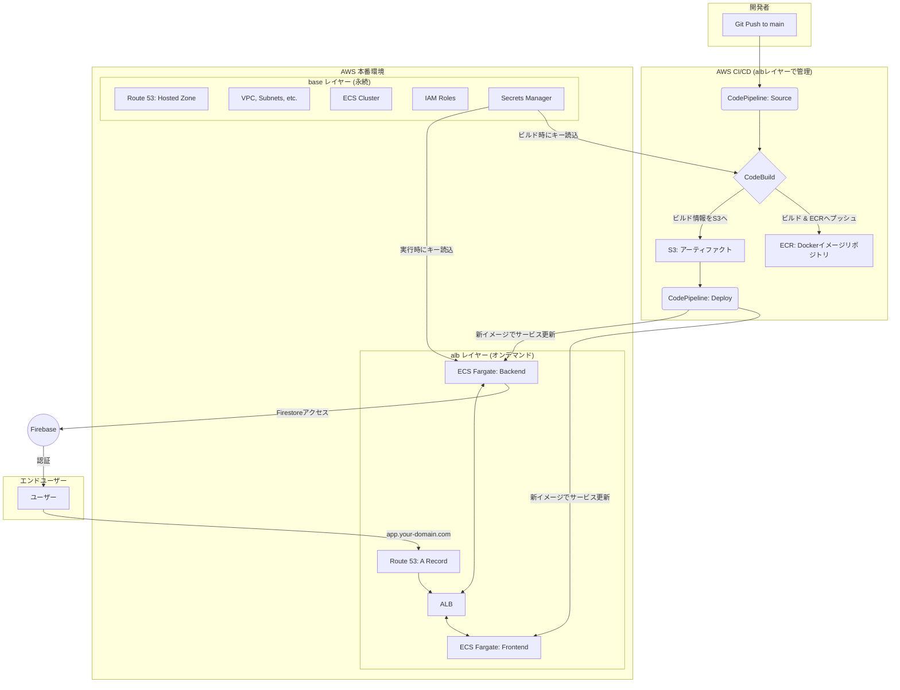

# LifePlan - 未来家計シミュレーションアプリ

未来の家計をシミュレーションし、可視化するためのWebアプリケーションです。

## 📜 目次

- [✨ はじめに](#-はじめに)
- [🏗️ アーキテクチャ概要](#️-アーキテクチャ概要)
- [🛠️ 技術スタック](#️-技術スタック)
- [📂 プロジェクト構造](#-プロジェクト構造)
- [💻 ローカル開発環境セットアップ](#-ローカル開発環境セットアップ)
  - [前提ツール](#前提ツール)
  - [セットアップ手順](#セットアップ手順)
- [🚀 本番環境のセットアップと運用](#-本番環境のセットアップと運用)
  - [前提条件](#前提条件-1)
  - [初回デプロイ手順](#初回デプロイ手順)
  - [サービスの起動・停止 (コスト削減)](#サービスの起動停止-コスト削減)
  - [CI/CDによる自動デプロイ](#cicdによる自動デプロイ)
- [🔒 環境変数とシークレット管理](#-環境変数とシークレット管理)
- [🔮 今後の改善案](#-今後の改善案)

## ✨ はじめに

このプロジェクトは、React(Create React App)によるフロントエンドとNode.js(Express)によるバックエンドで構成されるモノレポです。
AWS上のインフラはTerraformでコード管理されており、`base`レイヤー（永続的なリソース）と`alb`レイヤー（オンデマンドリソース）に分割されています。これにより、開発時間外はALBやECSサービスといったコストのかかるリソースを安全に削除でき、コスト効率の高い運用が可能です。

## 🏗️ アーキテクチャ概要

CI/CDはAWS CodePipelineとCodeBuildで構築されており、`main`ブランチへのプッシュをトリガーに、自動でビルドとデプロイが実行されます。



## 🛠️ 技術スタック

| カテゴリ | 技術 |
|---|---|
| **フロントエンド** | React, TypeScript, Create React App, pnpm, Tailwind CSS, Chart.js |
| **バックエンド** | Node.js, Express, TypeScript, pnpm, Zod |
| **データベース** | Google Firestore |
| **インフラ** | AWS (ECS Fargate, ALB, ECR, S3, Route 53, Secrets Manager, CloudWatch), Terraform |
| **CI/CD** | AWS CodePipeline, AWS CodeBuild, GitHub |

## 📂 プロジェクト構造

```
.
├── backend/         # バックエンド (Node.js/Express)
├── frontend/        # フロントエンド (React/CRA)
├── infra/
│   ├── base/        # 永続インフラ (VPC, ECR, ECS Cluster, Route53 Zone etc.)
│   └── alb/         # オンデマンドインフラ (ALB, ECS Service, Route53 Record, CodePipeline etc.)
├── scripts/         # サービスの起動・停止用スクリプト
├── buildspec.yml    # CodeBuild定義ファイル
└── docker-compose.yml # ローカル開発環境定義
```

## 💻 ローカル開発環境セットアップ

### 前提ツール

- Node.js (v18.x以降)
- pnpm (v8.x以降)
- Docker & Docker Compose

### セットアップ手順

1.  **リポジトリのクローンと依存関係のインストール**
    ```bash
    git clone <repository_url>
    cd LifePlan
    pnpm install
    ```

2.  **環境変数の設定**
    `backend/.env.example` と `frontend/.env.example` をコピーして、それぞれ `.env` ファイルを作成します。
    -   `frontend/.env`: `frontend/.env.example` をコピーし、必要に応じて値を編集します。
        ```bash
        cp frontend/.env.example frontend/.env
        ```
    -   `backend/.env`: FirebaseのサービスアカウントキーJSONをBase64エンコードして設定します。
        ```bash
        cp backend/.env.example backend/.env
        # macOS/Linuxの場合
        base64 -i path/to/your/serviceAccountKey.json | tr -d '\n' 
        # 上記で出力された文字列を backend/.env の SERVICE_ACCOUNT_KEY に設定
        ```

3.  **開発サーバーの起動（ホットリロード有効）**
    以下のコマンドを実行すると、フロントエンドとバックエンドの開発サーバーが起動します。
    ```bash
    pnpm dev
    ```
    -   **フロントエンド**: `http://localhost:3000`
        -   ソースコード (`frontend/src`配下) を変更すると、自動でブラウザがリロードされます。
    -   **バックエンド API**: `http://localhost:3001`

4.  **開発環境の停止**
    コンテナを停止・削除するには、以下のコマンドを実行します。
    ```bash
    pnpm dev:down
    ```

---
<br>

### 従来の起動方法（静的ビルド）
**注意:** こちらはホットリロードには対応していません。本番に近い環境を確認したい場合に使用します。
```bash
docker compose up --build
```

## 🚀 本番環境のセットアップと運用

### 前提条件

1.  **AWSアカウント** と、認証情報が設定された **AWS CLI**。
2.  **ドメインの取得**: Route 53などでドメイン（例: `life-plan-simulator.com`）を取得済みであること。
3.  **Firebaseプロジェクト**と**サービスアカウントキー**のJSONファイル。
4.  **GitHubリポジトリ**。

### 初回デプロイ手順

#### ステップ1: `base`レイヤーのデプロイ (永続インフラ)

1.  **シークレットの登録 (AWS Secrets Manager)**:
    AWSコンソールでSecrets Managerを開き、以下の2つのシークレットを新規作成します。

    -   **Firebase認証情報**:
        -   **シークレット名**: `prd/life-plan-app/firebase`
        -   **シークレットのタイプ**: 「その他のシークレットのタイプ」
        -   **キー/バリュー**: 「プレーンテキスト」を選択し、FirebaseのサービスアカウントキーJSONファイルの中身を**そのまま**貼り付けます。

    -   **Docker Hub認証情報**:
        -   **シークレット名**: `dockerhub/credentials`
        -   **シークレットのタイプ**: 「その他のシークレットのタイプ」
        -   **キー/バリュー**: 「プレーンテキスト」を選択し、Docker Hubで生成した**アクセストークンのみ**を貼り付けます。
        > **なぜ必要？**: CodeBuildがDocker Hubからベースイメージをプルする際に、レート制限（匿名ユーザーへのダウンロード回数制限）に引っかかるのを防ぐためです。

2.  **`terraform.tfvars`の作成**:
    `infra/base/` ディレクトリに `terraform.tfvars` というファイルを作成し、取得したドメイン名を設定します。
    ```tfvars
    # infra/base/terraform.tfvars
    domain_name = "your-domain.com"
    ```

3.  **`base`の適用**:
    `infra/base` ディレクトリでTerraformを実行し、VPCやECRなどのコアインフラを構築します。
    ```bash
    cd infra/base
    terraform init
    terraform apply
    ```

4.  **Route 53ホストゾーンのインポート**:
    ドメインをRoute 53で管理している場合、`apply`は成功します。Route 53以外で管理している場合、または手動で作成した場合は、ここで表示されるホストゾーンIDを使ってインポートが必要です。
    ```bash
    # `terraform apply`後に表示されるHosted Zone ID (例: Z1234567890) を使用
    terraform import 'aws_route53_zone.main' <Hosted Zone ID>
    ```

#### ステップ2: `alb`レイヤーのデプロイ (オンデマンドインフラ)

1.  **`terraform.tfvars`の作成**:
    `infra/alb/` ディレクトリに `terraform.tfvars` というファイルを作成し、ドメイン情報と**Docker Hubのユーザー名**を設定します。
    ```tfvars
    # infra/alb/terraform.tfvars
    domain_name        = "your-domain.com"
    subdomain_name     = "app" # 例: app.your-domain.com
    dockerhub_username = "your-dockerhub-username"
    ```

2.  **`alb`の適用（サービスの起動）**:
    プロジェクトルートに戻り、`start_services.sh` スクリプトを実行します。これによりALB、ECSサービス、CI/CDパイプラインなどが構築されます。
    ```bash
    cd ../..
    ./scripts/start_services.sh
    ```

3.  **CodeStar Connectionの承認**:
    AWSコンソールの「Developer Tools」 > 「Connections」に移動し、Terraformが作成した`github-connection`が「保留中」になっています。これをクリックしてGitHubとの連携を承認してください。

4.  **パイプラインの手動実行**:
    初回のみ、CodePipelineのコンソールから `lifeplan-pipeline` を選択し、「変更をリリース」ボタンを押して手動で実行します。これにより、アプリケーションが初めてデプロイされます。

### サービスの起動・停止 (コスト削減)

開発時間外にコストを節約するため、ALBやECSサービスを安全に停止・再開できます。

- **サービス停止**:
  ```bash
  ./scripts/stop_services.sh
  ```
  このスクリプトは `infra/alb` ディレクトリで `terraform destroy` を実行し、オンデマンドリソースを削除します。

- **サービス起動**:
  ```bash
  ./scripts/start_services.sh
  ```
  このスクリプトは `infra/alb` ディレクトリで `terraform apply` を実行し、オンデマンドリソースを再作成します。

### CI/CDによる自動デプロイ

一度セットアップが完了すれば、`main`ブランチにプッシュするだけで、CodePipelineが自動的にアプリケーションをビルドし、ECSへデプロイします。

## 🔒 環境変数とシークレット管理

| 環境 | 設定ファイル/場所 | 説明 |
|:---|:---|:---|
| **ローカル** | `frontend/.env`, `backend/.env` | `docker-compose.yml`によって各サービスのコンテナに読み込まれます。 |
| **本番 (Firebase)** | AWS Secrets Manager `prd/life-plan-app/firebase` | CodeBuildでのビルド時、およびECSタスクの実行時に、IAMロールを通じて安全に読み込まれます。 |
| **本番 (Docker Hub)** | AWS Secrets Manager `dockerhub/credentials` | CodeBuildでのビルド時にDocker Hubへのログインに使用されます。値は**アクセストークン（プレーンテキスト）**です。 |
| **本番 (Docker Hub)** | CodeBuild環境変数 `DOCKERHUB_USERNAME` | Docker Hubへのログインに使用されるユーザー名です。`infra/alb/terraform.tfvars`で設定します。 |

> **補足**: Terraformコードには一切の秘密情報（APIキーやパスワード）が含まれません。すべてAWS Secrets ManagerとCodeBuildの環境変数で管理されます。

## 🔮 今後の改善案

- **Terraform Stateの共有**: 現在ローカル管理のStateをS3バックエンドとDynamoDBによるロック機構に移行し、チーム開発を容易にする。
- **ステージング環境の構築**: `main`ブランチとは別に`develop`ブランチ用のインフラ・パイプラインを構築し、本番デプロイ前の検証を行えるようにする。
- **監視体制の強化**: CloudWatchダッシュボードやアラームを設定し、アプリケーションの健全性を常時監視する。
- **CIの有効化**: GitHub Actionsを有効化し、Pull Request時の自動テストとリンター実行を導入する。
- **HTTPS対応**: ALBにACM証明書を割り当て、HTTPS通信を有効化する。

## 開発環境

### 開発環境の起動

1.  必要なツール（Docker, pnpm）をインストールします。
2.  以下のコマンドを実行すると、フロントエンドとバックエンドの開発環境がDockerコンテナとして起動します。

```bash
pnpm dev
```

-   フロントエンド: `http://localhost:3000` (ホットリロード対応)
-   バックエンド: `http://localhost:3001` (ホットリロード対応)

### 開発環境の停止

```bash
pnpm dev:down
```

## ✅ テスト

プロジェクトにはフロントエンドとバックエンドのユニットテストが設定されています。

### フロントエンド (Vitest)

モダンなテストフレームワークである **Vitest** を使用しています。設定は `frontend/vitest.config.ts` にあります。

```bash
# フロントエンドのテストをすべて実行
pnpm --filter lifeplan-frontend test

# UIモードでテストを起動（インタラクティブな操作が可能）
pnpm --filter lifeplan-frontend test:ui
```

### バックエンド (Jest)

標準的なテストフレームワークである **Jest** を使用しています。

```bash
# バックエンドのテストをすべて実行
pnpm --filter lifeplan-backend test
```

### 統合テスト (CI)

`main`ブランチへのプルリクエスト時には、GitHub Actionsによってフロントエンドとバックエンド両方のテストが自動的に実行されます。詳細はCI/CDのセクションを参照してください。

---
<br>

## CI/CD

### 自動チェック (CI)

`main`ブランチへのプルリクエスト時には、GitHub Actionsによる自動チェックが実行されます。
このチェックは、以下の2つのジョブで構成されています。

1.  **本番ビルドチェック**: 本番環境用のDockerイメージ (`docker-compose.yml`を使用) が正常にビルドできることを確認します。
2.  **テスト実行**: フロントエンド(Vitest)とバックエンド(Jest)のユニットテストを実行します。

これにより、開発環境での変更が本番環境のビルドに影響を与えないこと、そして既存の機能が壊れていないことを保証します。

設定ファイル: `.github/workflows/ci.yml`

## デプロイ

（省略）

