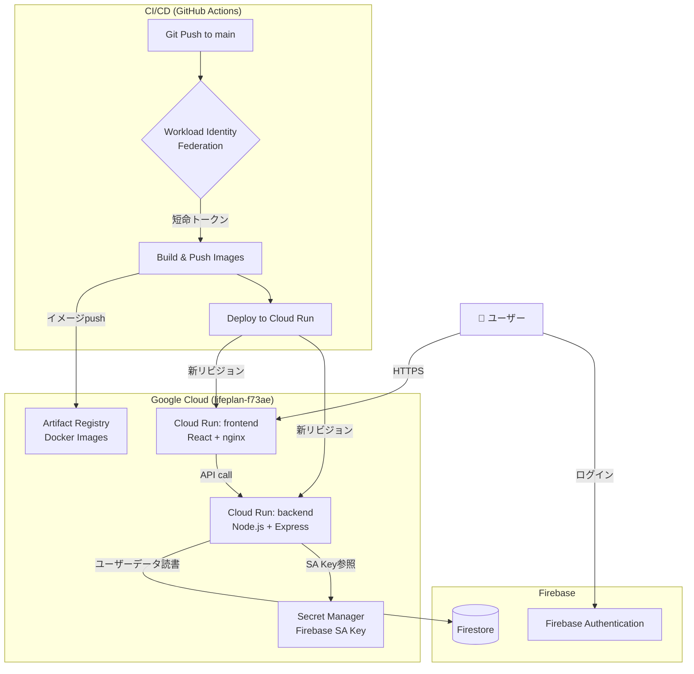

# LifePlan - 未来家計シミュレーションアプリ

個人のライフプランに基づいた未来の家計をシミュレーションし、可視化するWebアプリケーションです。

## 📜 目次

- [✨ 概要](#-概要)
- [🛠️ 技術スタック](#️-技術スタック)
- [📂 プロジェクト構造](#-プロジェクト構造)
- [�� ローカル開発](#-ローカル開発)
  - [🔧 前提ツールのインストール](#-前提ツールのインストール)
  - [🚀 開発環境のセットアップ](#-開発環境のセットアップ)
  - [⚙️ CORS設定について](#️-cors設定について)
- [✅ テスト](#-テスト)
- [🚀 本番環境（Google Cloud Run）](#-本番環境google-cloud-run)
- [🔄 CI/CD](#-cicd)
- [🔒 環境変数とシークレット](#-環境変数とシークレット)
- [🔮 今後の改善案](#-今後の改善案)

## ✨ 概要

React (Create React App) と Node.js (Express) によるモノレポ構成の Webアプリケーションです。
インフラは **Google Cloud Run** にデプロイされ、認証データベースは **Firebase** を使用しています。
CI/CD は **GitHub Actions + Workload Identity Federation（キーレス認証）** で構築しています。

> 📘 **アーキテクチャ解説スライド**: [docs/architecture.html](docs/architecture.html) をブラウザで開くと、図解で構成を一通り把握できます。

**アーキテクチャの特徴**:
- **サーバレス**: Cloud Run の min-instances=0 でアイドル時はコスト0円
- **キーレス**: GitHub Actions から GCP への認証は WIF 経由で、JSON キーをリポに置かない
- **マネージドDB**: Firestore + Firebase Auth で、運用負荷を最小化


```mermaid
graph TD
    User[👤 ユーザー]

    subgraph "Google Cloud (lifeplan-f73ae)"
        FE[Cloud Run: frontend<br/>React + nginx]
        BE[Cloud Run: backend<br/>Node.js + Express]
        SM[Secret Manager<br/>Firebase SA Key]
        AR[Artifact Registry<br/>Docker Images]
    end

    subgraph "Firebase"
        Auth[Firebase Authentication]
        FS[(Firestore)]
    end

    subgraph "CI/CD (GitHub Actions)"
        Push[Git Push to main]
        WIF{Workload Identity<br/>Federation}
        Build[Build & Push Images]
        Deploy[Deploy to Cloud Run]
    end

    User -- HTTPS --> FE
    FE -- API call --> BE
    BE -- ユーザーデータ読書 --> FS
    BE -- SA Key参照 --> SM
    User -- ログイン --> Auth

    Push --> WIF
    WIF -- 短命トークン --> Build
    Build -- イメージpush --> AR
    Build --> Deploy
    Deploy -- 新リビジョン --> FE
    Deploy -- 新リビジョン --> BE
```

## 🛠️ 技術スタック

| カテゴリ | 技術 |
| :--- | :--- |
| **フロントエンド** | React, TypeScript, Create React App, pnpm, Tailwind CSS, Chart.js |
| **バックエンド** | Node.js, Express, TypeScript, pnpm, Zod |
| **データベース** | Google Firestore |
| **認証** | Firebase Authentication |
| **インフラ** | Google Cloud Run (asia-northeast1), Artifact Registry, Secret Manager |
| **CI/CD** | GitHub Actions + Workload Identity Federation（キーレス認証） |

## 📂 プロジェクト構造

```
.
├── .github/workflows/
│   ├── ci.yml              # PR時のテスト・ビルドチェック
│   └── cd.yml              # mainプッシュ時のCloud Runデプロイ
├── backend/                # バックエンド (Node.js/Express)
│   ├── Dockerfile          # 本番用イメージ定義
│   └── src/
├── frontend/               # フロントエンド (React/CRA)
│   ├── Dockerfile          # 本番用イメージ定義（nginx）
│   └── src/
├── docs/
│   └── architecture.html   # アーキテクチャ解説スライド（ジュニア向け）
├── docker-compose.dev.yml  # ローカル開発用
└── pnpm-workspace.yaml
```

> ⚠️ `infra/`（Terraform）と `scripts/start_services.sh, stop_services.sh` は旧AWS時代の遺物です。Cloud Run 移行（2026-05）後は使用していません。削除予定。

## 💻 ローカル開発

### 🔧 前提ツールのインストール

開発を始める前に、以下のツールをインストールしてください：

**1. Node.js (v18+)**
```bash
# Node.jsのインストール (推奨: nvmを使用)
# macOS/Linux
curl -o- https://raw.githubusercontent.com/nvm-sh/nvm/v0.39.0/install.sh | bash
nvm install 18
nvm use 18

# Windows
# Node.js公式サイトからインストーラーをダウンロード
# https://nodejs.org/
```

**2. pnpm (v8+)**
```bash
# npmから pnpm をインストール
npm install -g pnpm

# または、Homebrewを使用 (macOS)
brew install pnpm

# または、pnpmの公式インストーラーを使用
curl -fsSL https://get.pnpm.io/install.sh | sh -

# インストール確認
pnpm --version
```

**3. Docker**
```bash
# macOS
brew install --cask docker

# Windows/Linux
# Docker公式サイトからDocker Desktopをダウンロード
# https://www.docker.com/products/docker-desktop/
```

### 🚀 開発環境のセットアップ

**1. リポジトリの準備**:
```bash
git clone <repository_url>
cd LifePlan
pnpm install
```

**2. 環境変数の設定**:

各ディレクトリの `.env.example` をコピーして `.env` ファイルを作成します。

```bash
cp frontend/.env.example frontend/.env
cp backend/.env.example backend/.env
```

| ファイル | 設定が必要な項目 |
|---------|----------------|
| `frontend/.env` | Firebase設定（`REACT_APP_FIREBASE_*`）を入力 |
| `backend/.env` | `SERVICE_ACCOUNT_KEY` を入力 |

> **📝 SERVICE_ACCOUNT_KEY の取得方法**:
> Firebase Console > プロジェクト設定 > サービスアカウント > 新しい秘密鍵を生成 でJSONをダウンロードし、以下でBase64エンコードします:
> ```bash
> base64 -i path/to/serviceAccountKey.json | tr -d '\n'
> ```

**3. 開発サーバーの起動**:
```bash
pnpm dev
```

#### 📱 PCブラウザからのアクセス

- フロントエンド: http://localhost:3000
- バックエンド: http://localhost:3001

> **⚠️ 注意**: `frontend/.env` の `REACT_APP_BACKEND_URL` は**コメントアウト**してください。  
> 設定されていると `localhost` ではなく指定IPに接続しようとしてエラーになります。
> ```bash
> # frontend/.env
> # REACT_APP_BACKEND_URL=http://192.168.1.100:3001  ← コメントアウトのまま
> ```

#### 📲 実機（スマートフォン）からのアクセス

実機からアクセスする場合は、以下の設定が**すべて必須**です。  
⚠️ **IPアドレスが変更された場合は、手順1〜4を再度実施してください。**

1. **PCのローカルIPアドレスを確認**:
   ```bash
   # macOS/Linux
   ipconfig getifaddr en0
   ```

2. **`frontend/.env` を更新**:
   ```bash
   REACT_APP_BACKEND_URL=http://<あなたのPCのIPアドレス>:3001
   ```

3. **`backend/.env` を更新**:
   ```bash
   CORS_ORIGINS=http://<あなたのPCのIPアドレス>:3000
   
   # 複数のデバイスからアクセスする場合はカンマ区切りで指定
   # CORS_ORIGINS=http://192.168.1.100:3000,http://10.0.0.50:3000
   ```

4. **Firebase Authentication に承認済みドメインを追加**:
   
   Firebase認証を使用しているため、実機からログインするにはドメインの承認が必要です。
   
   1. [Firebase Console](https://console.firebase.google.com/) を開く
   2. プロジェクトを選択 > **Authentication** > **設定** タブ
   3. **承認済みドメイン** セクションで「**ドメインの追加**」をクリック
   4. PCのIPアドレス（例: `192.168.1.100`）を追加
   
   > ⚠️ IPアドレスが変わるたびに新しいIPを追加する必要があります。

5. **開発サーバーを再起動**:
   ```bash
   pnpm dev:down
   pnpm dev
   ```

6. **スマートフォンのブラウザからアクセス**:
   ```
   http://<あなたのPCのIPアドレス>:3000
   ```

**4. 開発サーバーの停止**:
```bash
pnpm dev:down
```

### ⚙️ CORS設定について

本プロジェクトでは、環境変数を使用した柔軟なCORS設定を採用しています。

- **PCブラウザ**: `localhost:3000` と `127.0.0.1:3000` はデフォルトで許可されています（設定不要）
- **実機**: 環境変数 `CORS_ORIGINS` で許可するオリジンを追加します（設定手順は上記「実機からのアクセス」を参照）

**実装詳細**:
```typescript
// backend/src/server.ts
const getCorsOrigins = () => {
  const isDevelopment = process.env.NODE_ENV !== 'production';
  
  if (!isDevelopment) {
    // 本番環境では同じドメインからのアクセスのためCORS設定は不要
    return [];
  }
  
  // 開発環境でのデフォルト設定（NODE_ENVが未設定または'production'以外の場合）
  const defaultOrigins = [
    'http://localhost:3000',
    'http://127.0.0.1:3000',
  ];
  
  // 環境変数からカスタムオリジンを追加
  const customOrigins = process.env.CORS_ORIGINS 
    ? process.env.CORS_ORIGINS.split(',').map(origin => origin.trim())
    : [];
  
  return [...defaultOrigins, ...customOrigins];
};
```

> **📝 補足**: `NODE_ENV` を明示的に設定する必要はありません。未設定の場合は開発モードとして動作します。本番環境では `NODE_ENV=production` が設定されます。

**利点**:
- IPアドレスが変わってもコードを修正する必要がない
- 複数のデバイスからのアクセスを簡単に設定可能
- 本番環境では自動的にCORS制限が適用される
- 環境に応じた柔軟な設定が可能

## ✅ テスト

- **フロントエンド (Vitest)**:
  ```bash
  # 全テスト実行
  pnpm --filter lifeplan-frontend test
  # UIモードで起動
  pnpm --filter lifeplan-frontend test:ui
  ```
- **バックエンド (Jest)**:
  ```bash
  # 全テスト実行
  pnpm --filter lifeplan-backend test
  # ウォッチモードで起動
  pnpm --filter lifeplan-backend test --watch
  ```

## 🚀 本番環境（Google Cloud Run）

**前提**: GCPアカウント, gcloud CLI, Firebaseプロジェクト, GitHubリポジトリ

### URL
- **frontend**: https://lifeplan-frontend-qn2crluibq-an.a.run.app/
- **backend**: https://lifeplan-backend-qn2crluibq-an.a.run.app/

### Cloud Run の設定
| 項目 | backend | frontend |
|:---|:---|:---|
| Memory | 256Mi | 128Mi |
| CPU | 1 | 1 |
| Min instances | 0（コールドスタート許容） | 0 |
| Max instances | 2 | 2 |
| Port | 3001 | 80 |

### 初回セットアップ手順
1. **GCP プロジェクト作成** & 以下のAPI有効化:
   - Cloud Run, Artifact Registry, Secret Manager, IAM Credentials, STS, IAM
2. **Artifact Registry リポジトリ作成**: `lifeplan`（asia-northeast1, Docker形式）
3. **Firebase サービスアカウントキーを Secret Manager に登録**: 名前は `firebase-service-account`
4. **Workload Identity Federation セットアップ**: 後述「CI/CD」章を参照
5. **GitHub Secrets を設定**: 後述「環境変数とシークレット」章を参照
6. **mainブランチにpush** → GitHub Actions が自動デプロイ

## 🔄 CI/CD

GitHub Actions + **Workload Identity Federation（WIF, キーレス認証）** で構成しています。
JSON のサービスアカウントキーを GitHub Secrets に置かない設計です。

### CI（PR時）
`.github/workflows/ci.yml` がトリガー。テスト・ビルドチェックを実行。

### CD（mainマージ時）
`.github/workflows/cd.yml` がトリガー。以下の流れ:

1. GitHub Actions が起動、OIDC トークンを自動取得
2. GCP の Workload Identity Provider に提示 → 短命の GCP アクセストークン発行（有効1時間）
3. そのトークンで `github-actions-deployer@lifeplan-f73ae.iam.gserviceaccount.com` に impersonate
4. Backend / Frontend の Docker イメージをビルドし Artifact Registry に push
5. Cloud Run に新リビジョンとしてデプロイ
6. ジョブ終了、トークン自動失効

### WIF の構成

| 項目 | 値 |
|:---|:---|
| GCP Project Number | `401060844770` |
| Pool | `github-pool` |
| Provider | `github-provider` |
| 受入条件 | `repository_owner == 'kaz-mathui' && repository == 'kaz-mathui/LifePlan'` |
| デプロイ SA | `github-actions-deployer@lifeplan-f73ae.iam.gserviceaccount.com` |
| SA ロール | `run.admin` / `artifactregistry.writer` / `iam.serviceAccountUser` / `secretmanager.secretAccessor` |

## 🔒 環境変数とシークレット

| 環境 | 設定場所 | 詳細 |
|:---|:---|:---|
| **ローカル** | `frontend/.env`, `backend/.env` | `docker-compose.dev.yml` により各コンテナに読み込まれます |
| **本番（コード時注入）** | GitHub Secrets | `REACT_APP_BACKEND_URL`, `CORS_ORIGINS` — ビルド時に build-arg / 環境変数として注入 |
| **本番（実行時）** | GCP Secret Manager | `firebase-service-account` — Cloud Run の `--set-secrets` で `SERVICE_ACCOUNT_KEY` 環境変数として注入 |
| **GCP認証** | **WIF（鍵なし）** | GitHub Secrets に JSON キーは置かない。WIF が OIDC トークンを短命GCPトークンに引き換える |

## 🔮 今後の改善案

- 旧AWS時代の `infra/`（Terraform）と `scripts/start_services.sh, stop_services.sh` を削除
- ステージング環境（プレビュー Cloud Run）
- Cloud Monitoring / Logging のダッシュボード整備
- カスタムドメイン割当（現状は `*.run.app`）
- ESLint と Prettier 統一
- エラーハンドリングの強化（フロントエンド・バックエンド）

