# LifePlan - 未来家計シミュレーションアプリ

個人のライフプランに基づいた未来の家計をシミュレーションし、可視化するWebアプリケーションです。

## 📜 目次

- [✨ 概要](#-概要)
- [🛠️ 技術スタック](#️-技術スタック)
- [📂 プロジェクト構造](#-プロジェクト構造)
- [�� ローカル開発](#-ローカル開発)
  - [🔧 前提ツールのインストール](#-前提ツールのインストール)
  - [🚀 開発環境のセットアップ](#-開発環境のセットアップ)
  - [⚙️ CORS設定について](#️-cors設定について)
- [✅ テスト](#-テスト)
- [🚀 本番環境（AWS）](#-本番環境aws)
- [🔄 CI/CD](#-cicd)
- [🔒 環境変数とシークレット](#-環境変数とシークレット)
- [🔮 今後の改善案](#-今後の改善案)

## ✨ 概要

React (Create React App) と Node.js (Express) によるモノレポ構成のアプリケーションです。インフラは Terraform でコード管理され、AWS 上に構築されます。

**アーキテクチャの特徴**: インフラを**永続** (`base`) と**オンデマンド** (`alb`) の2レイヤーに分割。開発時間外は `alb` レイヤー（ALB, ECSサービス等）を `terraform destroy` することで、コストを最小限に抑えます。



## 🛠️ 技術スタック

| カテゴリ | 技術 |
| :--- | :--- |
| **フロントエンド** | React, TypeScript, Create React App, pnpm, Tailwind CSS, Chart.js |
| **バックエンド** | Node.js, Express, TypeScript, pnpm, Zod |
| **データベース** | Google Firestore |
| **インフラ** | AWS (ECS Fargate, ALB, ECR, S3, Route 53), Terraform |
| **CI/CD** | AWS CodePipeline, AWS CodeBuild, GitHub Actions |

## 📂 プロジェクト構造

```
.
├── .github/workflows/ci.yml # CI (テスト実行) の定義
├── backend/                 # バックエンド (Node.js/Express)
├── frontend/                # フロントエンド (React/CRA)
├── infra/
│   ├── base/                # 永続インフラ (VPC, ECR, ECS Clusterなど)
│   └── alb/                 # オンデマンドインフラ (ALB, ECS Service, CI/CDなど)
├── scripts/                 # サービス起動・停止スクリプト
└── pnpm-workspace.yaml
```

## 💻 ローカル開発

### 🔧 前提ツールのインストール

開発を始める前に、以下のツールをインストールしてください：

**1. Node.js (v18+)**
```bash
# Node.jsのインストール (推奨: nvmを使用)
# macOS/Linux
curl -o- https://raw.githubusercontent.com/nvm-sh/nvm/v0.39.0/install.sh | bash
nvm install 18
nvm use 18

# Windows
# Node.js公式サイトからインストーラーをダウンロード
# https://nodejs.org/
```

**2. pnpm (v8+)**
```bash
# npmから pnpm をインストール
npm install -g pnpm

# または、Homebrewを使用 (macOS)
brew install pnpm

# または、pnpmの公式インストーラーを使用
curl -fsSL https://get.pnpm.io/install.sh | sh -

# インストール確認
pnpm --version
```

**3. Docker**
```bash
# macOS
brew install --cask docker

# Windows/Linux
# Docker公式サイトからDocker Desktopをダウンロード
# https://www.docker.com/products/docker-desktop/
```

### 🚀 開発環境のセットアップ

**1. リポジトリの準備**:
```bash
git clone <repository_url>
cd LifePlan
pnpm install
```

**2. 環境変数の設定**:
各ディレクトリの `.env.example` をコピーして `.env` ファイルを作成し、内容を編集します。
- **フロントエンド**: `cp frontend/.env.example frontend/.env`
- **バックエンド**: `cp backend/.env.example backend/.env`
    - `SERVICE_ACCOUNT_KEY`には、FirebaseのサービスアカウントキーJSONをBase64エンコードした文字列を設定します。
    - `base64 -i path/to/serviceAccountKey.json | tr -d '\n'`

**3. 開発サーバーの起動**:
```bash
pnpm dev
```
- **PCブラウザからのアクセス**:
    - フロントエンド: `http://localhost:3000`
    - バックエンド: `http://localhost:3001`
- **実機（スマートフォン）からのアクセス**:
    1. PCのローカルIPアドレスを確認します (`ipconfig getifaddr en0` など)。
    2. `frontend/.env` に `REACT_APP_BACKEND_URL=http://<あなたのPCのIPアドレス>:3001` を設定します。
    3. 開発サーバーを再起動します (`pnpm dev`)。
    4. スマートフォンのブラウザから `http://<あなたのPCのIPアドレス>:3000` にアクセスします。

**4. 開発サーバーの停止**:
```bash
pnpm dev:down
```

### ⚙️ CORS設定について

**動的CORS設定**:
本プロジェクトでは、環境変数を使用した柔軟なCORS設定を採用しています。IPアドレスを変更するたびにコードを修正する必要がありません。

**設定方法**:
1. **デフォルト設定**: 開発環境では `localhost:3000` と `127.0.0.1:3000` が自動的に許可されます。
2. **カスタム設定**: 実機からのアクセスには環境変数 `CORS_ORIGINS` を使用します。

**実機からのアクセス設定例**:
```bash
# backend/.env ファイルに追加
CORS_ORIGINS=http://192.168.1.100:3000,http://10.0.0.50:3000
```

**設定手順**:
1. PCのローカルIPアドレスを確認:
   ```bash
   # macOS/Linux
   ipconfig getifaddr en0
   # または
   ifconfig | grep "inet " | grep -v 127.0.0.1
   
   # Windows
   ipconfig | findstr /i "IPv4"
   ```

2. `backend/.env` ファイルに `CORS_ORIGINS` を追加:
   ```bash
   # 例：IPアドレスが 192.168.1.100 の場合
   CORS_ORIGINS=http://192.168.1.100:3000
   
   # 複数のIPアドレスがある場合（カンマ区切り）
   CORS_ORIGINS=http://192.168.1.100:3000,http://10.0.0.50:3000
   ```

3. 開発サーバーを再起動:
   ```bash
   pnpm dev:down
   pnpm dev
   ```

4. 実機から `http://あなたのPCのIPアドレス:3000` にアクセス

**現在の実装**:
```typescript
// backend/src/server.ts
const getCorsOrigins = () => {
  const isDevelopment = process.env.NODE_ENV === 'development';
  
  if (!isDevelopment) {
    // 本番環境では同じドメインからのアクセスのためCORS設定は不要
    return [];
  }
  
  // 開発環境でのデフォルト設定
  const defaultOrigins = [
    'http://localhost:3000',
    'http://127.0.0.1:3000',
  ];
  
  // 環境変数からカスタムオリジンを追加
  const customOrigins = process.env.CORS_ORIGINS 
    ? process.env.CORS_ORIGINS.split(',').map(origin => origin.trim())
    : [];
  
  return [...defaultOrigins, ...customOrigins];
};
```

**利点**:
- IPアドレスが変わってもコードを修正する必要がない
- 複数のデバイスからのアクセスを簡単に設定可能
- 本番環境では自動的にCORS制限が適用される
- 環境に応じた柔軟な設定が可能

## ✅ テスト

- **フロントエンド (Vitest)**:
  ```bash
  # 全テスト実行
  pnpm --filter lifeplan-frontend test
  # UIモードで起動
  pnpm --filter lifeplan-frontend test:ui
  ```
- **バックエンド (Jest)**:
  ```bash
  # 全テスト実行
  pnpm --filter lifeplan-backend test
  # ウォッチモードで起動
  pnpm --filter lifeplan-backend test --watch
  ```

## 🚀 本番環境（AWS）

**前提**: AWSアカウント, AWS CLI, 取得済みドメイン, Firebaseプロジェクト, GitHubリポジトリ

1.  **永続インフラ (`base`) のデプロイ**:
    1.  **シークレット登録**: AWS Secrets Managerに `prd/life-plan-app/firebase` (FirebaseキーJSON) と `dockerhub/credentials` (DockerHubアクセストークン) を作成します。
    2.  **変数設定**: `infra/base/terraform.tfvars` に `domain_name` を設定します。
    3.  **適用**: `cd infra/base && terraform init && terraform apply` を実行します。

2.  **オンデマンドインフラ (`alb`) のデプロイ**:
    1.  **変数設定**: `infra/alb/terraform.tfvars` に `domain_name`, `subdomain_name`, `dockerhub_username` を設定します。
    2.  **適用**: プロジェクトルートで `./scripts/start_services.sh` を実行します。
    3.  **承認**: AWSコンソールの `CodeStar Connections` で保留中の接続を承認します。
    4.  **初回実行**: AWS `CodePipeline` のコンソールからパイプラインを手動で初回実行します。

**運用（コスト削減）**:
- **停止**: `./scripts/stop_services.sh` (`alb` レイヤーを `destroy`)
- **起動**: `./scripts/start_services.sh` (`alb` レイヤーを `apply`)

## 🔄 CI/CD

- **CI (Pull Request時)**: GitHub Actionsが `main` ブランチへのPRをトリガーに、全テストとビルドチェックを自動実行します。 (`.github/workflows/ci.yml`)
- **CD (Merge時)**: PRがマージされると、AWS CodePipelineが `main` ブランチの最新コードを検知し、ビルド→ECRへプッシュ→ECSへローリングアップデート、という一連のデプロイを自動で行います。

## 🔒 環境変数とシークレット

| 環境 | 設定場所 | 詳細 |
|:---|:---|:---|
| **ローカル** | `frontend/.env`, `backend/.env` | `docker-compose.yml` により各コンテナに読み込まれます。 |
| **本番** | AWS Secrets Manager, CodeBuild Env | Terraformコードには秘密情報を含まず、IAMロール経由で安全に読み込まれます。 |

## 🔮 今後の改善案

- Terraform StateのS3バックエンドへの移行
- ステージング環境の構築
- CloudWatchによる監視体制の強化
- HTTPS対応 (ALBへのACM証明書割当)
- CORS設定の環境変数化による動的設定
- ESLintとPrettierによるコード品質の統一化
- エラーハンドリングの強化（フロントエンド・バックエンド）
