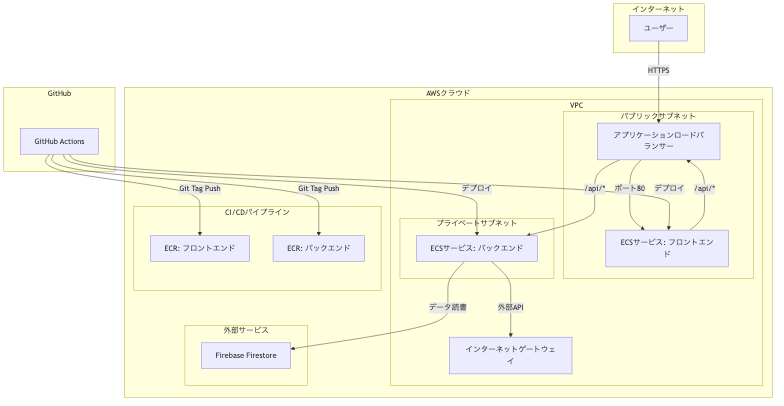
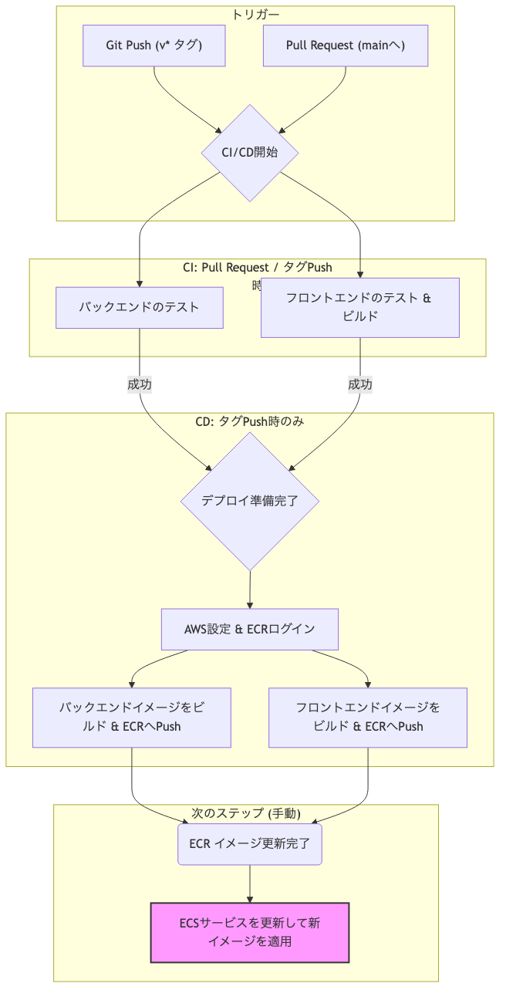

# LifePlan - クラウドネイティブ ライフプランシミュレーター

このプロジェクトは、ReactとNode.jsで構築されたライフプランシミュレーションアプリケーションを、Terraform, ECS Fargate, GitHub Actions を用いたモダンなCI/CD環境でAWS上に展開するためのサンプルリポジトリです。

## 概要

ユーザーは自身の年齢、収入、支出、ライフイベント（結婚、住宅購入など）を入力することで、将来の資産推移をシミュレーションできます。データはFirebaseに保存され、ユーザーごとに複数のライフプランを管理できます。

## 技術スタック

- **フロントエンド**: React, TypeScript, Vite, Tailwind CSS
- **バックエンド**: Node.js, Express, TypeScript
- **データベース**: Firebase (Firestore)
- **インフラストラクチャ (IaC)**: Terraform
- **クラウドプロバイダー**: AWS
  - **コンテナ**: ECS, Fargate
  - **ネットワーキング**: VPC, Application Load Balancer
  - **CI/CD**: ECR, CodePipeline (GitHub Actions経由)
- **CI/CD**: GitHub Actions

---

## アーキテクチャ

### インフラ構成図



### CI/CD フロー



1.  **開発**: 開発者がローカルでコードを修正し、`main`ブランチにpushします。
2.  **CI (GitHub Actions)**: Pull Requestが作成されると、GitHub Actionsが自動でテストとビルドを実行し、コードの品質を担保します。
3.  **CD (AWS CodePipeline)**: `main`ブランチへのpushをトリガーに、AWS CodePipelineがパイプラインを開始します。
    - **Source**: GitHubからソースコードを取得します。
    - **Build (CodeBuild)**: `buildspec.yml`に基づき、Dockerイメージをビルドし、ECRにプッシュします。
    - **Deploy (ECS)**: 新しいDockerイメージを使用して、ECS Fargate上のサービスを更新（ローリングアップデート）します。

---

## セットアップとローカル開発

### 必要なツール

- [Node.js](https://nodejs.org/) (v18以降)
- [pnpm](https://pnpm.io/installation)
- [Terraform](https://developer.hashicorp.com/terraform/tutorials/aws-get-started/install-cli) (v1.5以降)
- [AWS CLI](https://docs.aws.amazon.com/cli/latest/userguide/getting-started-install.html)

### 手順

1.  **リポジトリをクローン:**
    ```bash
    git clone https://github.com/kaz-mathui/LifePlan.git
    cd LifePlan
    ```

2.  **依存関係をインストール:**
    ```bash
    pnpm install --frozen-lockfile
    ```

3.  **Firebase設定:**
    - Firebaseコンソールでプロジェクトを作成します。
    - `frontend/` ディレクトリに `.env.local` ファイルを作成し、Firebaseプロジェクトの設定を記述します。
      ```sh
      # frontend/.env.local
      VITE_FIREBASE_API_KEY="your_api_key"
      VITE_FIREBASE_AUTH_DOMAIN="your_auth_domain"
      VITE_FIREBASE_PROJECT_ID="your_project_id"
      VITE_FIREBASE_STORAGE_BUCKET="your_storage_bucket"
      VITE_FIREBASE_MESSAGING_SENDER_ID="your_sender_id"
      VITE_FIREBASE_APP_ID="your_app_id"
      ```

4.  **AWS認証情報の設定:**
    AWS CLIがローカル環境からAWSを操作できるよう、認証情報を設定してください。
    ```bash
    aws configure
    ```

5.  **ローカルサーバーの起動:**
    - **フロントエンド:**
      ```bash
      pnpm --filter lifeplan-frontend dev
      ```
    - **バックエンド:** (別のターミナルで)
      ```bash
      pnpm --filter lifeplan-backend dev
      ```

---

## AWSインフラの構築とデプロイ

### 1. 初回インフラ構築

`infra` ディレクトリ内のTerraformコードを使って、AWS上に本番環境を構築します。

```bash
cd infra
terraform init
terraform plan
terraform apply --auto-approve

# 初回のみ、AWSコンソールでCodeStar Connectionの承認が必要です。
# terraform apply後に表示される指示に従ってください。

cd ..
```
これにより、VPC, ECSクラスター, ECRリポジトリ、そしてCI/CDパイプライン(CodePipeline)などが作成されます。

### 2. デプロイ

インフラが整ったら、アプリケーションをデプロイします。

**`main`ブランチにコードをpush（またはマージ）すると、自動的にAWS CodePipelineが起動し、ビルドとデプロイが実行されます。**

```bash
git checkout main
git add .
git commit -m "feat: Deploy new feature"
git push origin main
```
パイプラインの実行状況は、AWSコンソールのCodePipelineから確認できます。

### リリース管理のためのタグ付け (推奨)

デプロイのトリガーは`main`ブランチへのpushですが、本番リリースなど、特定のバージョンを記録しておきたい場合は、Gitタグを使用することが推奨されます。

```bash
# 例: v1.0.0 タグを作成し、リモートにpush
git tag v1.0.0
git push origin v1.0.0
```
これにより、どのコミットがどのバージョンに対応しているかが明確になります。

---

## アプリケーションの公開と停止 (コスト管理)

このアプリケーションは、何もしないと継続的にAWS利用料金（主にALBとECS Fargate）が発生します。**使用しないときは、以下のスクリプトでインフラを停止し、コストを最小限に抑えることを強く推奨します。**

### アプリケーションの停止

アプリケーションを停止し、ALBを削除して課金を止めます。

```bash
./scripts/stop_services.sh
```
このスクリプトは、ECSサービスのタスク数を0にし、Terraformを実行してALBを削除します。

### アプリケーションの再公開

停止したアプリケーションを再び公開状態にします。

```bash
./scripts/start_services.sh
```
このスクリプトは、Terraformを実行してALBを再作成し、ECSサービスのタスク数を1に戻します。

### 予想されるAWS費用 (月額)

**公開中 (`start_services.sh` 実行後):**
- Application Load Balancer: 約 $19 / 月
- ECS Fargate: 約 $15 / 月 (vCPU, Memoryによる)
- **CI/CD (CodePipeline & CodeBuild)**:
  - CodePipeline: $1 / 月 (アクティブなパイプラインごと)
  - CodeBuild: 最初の100分/月は無料。以降、ビルド時間に応じた従量課金 (約$0.005/分)
- NAT Gateway: 約 $4 / 月 (データ転送量により変動)
- **合計:** 約 $39 - $46 / 月

**停止中 (`stop_services.sh` 実行後):**
- S3 (Terraform state), ECR (Docker image), CodePipeline (非アクティブ時): ほぼ無料
- **合計:** 約 $0.1 / 月未満

**定期的に利用しない場合は、必ず `stop_services.sh` を実行してください。**

### さらなるコスト削減 (ベストプラクティス)

開発がアクティブでない期間など、さらにコストを削減したい場合は、以下の方法を検討できます。

- **CodePipelineの完全停止**:
  `infra/codepipeline.tf` 内の `resource "aws_codepipeline" "main"` ブロック全体をコメントアウト、または `count = 0` を追加して `terraform apply` を実行すると、パイプライン自体が削除され、月額$1の課金を停止できます。開発を再開する際に元に戻す必要があります。

- **ビルド時間の最適化**:
  CodeBuildの料金はビルド時間に基づきます。`buildspec.yml` や `Dockerfile` を最適化し、Dockerのレイヤーキャッシュを活用してビルド時間を短縮することは、長期的にコスト削減に繋がります。
